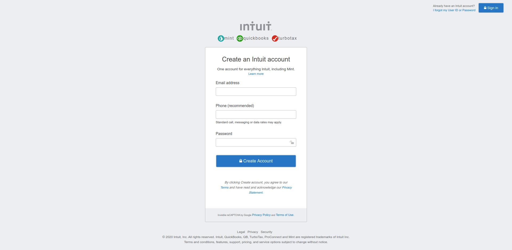

# html-forms

Cloning mint.com's sign up page
> ​
> 
> ​

## Built With

- HTML
- CSS
- Fontawesome
  ​

## Live Demo

​
[Live Demo Link](https://rawcdn.githack.com/mugberto/html-forms/dc9d7866ef7b54495304d193d706eca349d9f34f/index.html)
​
​

## Getting Started

​
**Clone the repo on your system, find the index.html file and open with your browser**
​
​

## Authors

​
#### 👤 **Hubert MUGABO**
​

- Github: [@mugberto](https://github.com/mugberto)
- Twitter: [@mugberto](https://twitter.com/mugberto)
- Linkedin: [mugberto](https://www.linkedin.com/in/hubert-mugabo-23144b6a/)

#### 👤 **Marshall AKPAN**

 ​
- Github: [@uimarshall](https://github.com/uimarshall)
- Twitter: [@uimarshall](https://twitter.com/uimarshall)
- Linkedin: [uimarshall](https://www.linkedin.com/in/marshall-akpan-19745526/)

 ​
## �� Contributing

​
Contributions, issues and feature requests are welcome!
​
Feel free to check the [issues page](https://github.com/uimarshall/Embedding-Images-and-Video/issues).
​

## Show your support

​
Give a ⭐️ if you like this project!
​

## Acknowledgments

- Fontawesome
- Our Stand up teams
- Microverse TSE

  ​
## �� License
​
This project is [MIT](lic.url) licensed.